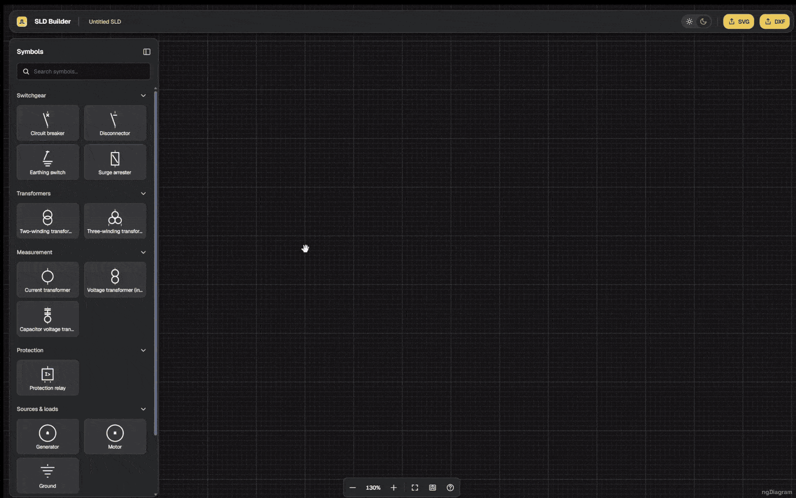

# ngDiagram Single-Line Diagram Template

[](https://opensource.org/licenses/MIT)

**Live demo:** [ngdiagram.dev/templates/single-line-diagram](https://www.ngdiagram.dev/templates/single-line-diagram/)



An Angular configurator for **single-line diagrams** (SLDs, also called
one-line diagrams) of high-voltage electrical substations, built on [ngDiagram](https://www.ngdiagram.dev/).
The symbol library targets the **IEC 60617** graphical standard: 15 symbols across
switchgear, transformers, measurement, protection, sources & loads, and
compensation. The bundled set was curated against HV transmission work
(>=110 kV), but the symbols and the node model are voltage-agnostic — MV and LV
distribution work the same way.

It doubles as a reference template for building a domain-specific node editor on
ngDiagram: a custom node/edge model, a generated symbol pipeline,
geometry-derived junctions, and a schema-driven properties panel.

Features:

- **IEC 60617 symbol library** — 15 symbols in six categories, generated from QElectroTech sources by a build script
- **Port-to-port wiring** with ngDiagram's orthogonal routing; reshape a wire by dragging its segments, relink an endpoint to another port
- **Junctions from geometry** — dropping or relinking a wire onto another wire splits it and creates a junction node; connection dots are derived from positions on every render, never stored
- **Rotate symbols** with the on-canvas handle, snapped to 90°, on an 8 px grid
- **Schema-driven properties panel** — each symbol declares its fields; the panel renders them with Formly
- **Export to SVG** and **DXF** (for CAD tools) from the navbar
- **Minimap, zoom toolbar, and keyboard cheat sheet**; dark/light theme

## Getting Started

Built against Angular 19.2 and ngDiagram 1.3 (see `package.json`); Node.js 18.19+, 20.11+ or 22 and npm 10+.

```bash
git clone https://github.com/synergycodes/ng-diagram-single-line-diagram.git
cd ng-diagram-single-line-diagram
npm install
npm start
```

Open [http://localhost:4200](http://localhost:4200) — the canvas starts empty, with the symbol library on the left. Drag a two-winding transformer and a circuit breaker onto the canvas, draw a wire between their terminals, then drop a second wire onto the first to see a junction appear. There is no seed diagram to replace: what you draw is the model.

## Scripts

| Command | What it does |
| --- | --- |
| `npm start` | Dev server with hot reload (`ng serve`). |
| `npm run build` | Production build to `dist/single-line-diagram`. |
| `npm run watch` | Development build in watch mode. |
| `npm test` | Unit tests via Karma + Jasmine (`npm run test:ci` runs them once, headless). |
| `npm run build:symbols` | Regenerate the symbol registry from the QElectroTech sources. |
| `npm run lint` | Lint with ESLint (angular-eslint). |
| `npm run format` | Format with Prettier; `npm run format:check` verifies without writing. |

## Architecture

The app is a single standalone-component Angular app. The route `''` lazy-loads
`SldPageComponent`, which hosts a header, the symbol library (left), the canvas
(center), and the properties panel (right). `provideNgDiagram()` is provided on
that page, not at the bootstrap root, because ngDiagram services inject the
host `ElementRef`.

### Editing model

Editing is native ngDiagram: symbol ports are visible, the user draws edges
port-to-port, and edges use ngDiagram's built-in orthogonal routing. Dropping
or relinking an edge onto another edge splits it and creates a real
`sld-junction` node at the meeting point. A separate overlay paints connection
dots wherever 3+ wire-continuations coincide; those dots are derived from world
positions every render and never stored, so they can't drift from the geometry.

### Node types

- `sld-symbol`: an IEC 60617 device. Fixed-size body plus dynamic leads (stubs
  from each terminal to the body edge that fill the gap to the bounding box).
- `sld-junction`: an 8 px node with four directional ports, created and torn
  down automatically as edges meet.

### Keyboard shortcuts

The app uses ngDiagram's built-in shortcuts, also listed in the in-app cheat
sheet (the help button on the zoom toolbar). Symbol rotation is done with the
on-canvas rotate handle, snapped to 90°.

| Keys | Action |
| --- | --- |
| `Click` / `Ctrl`+`Click` | Select / add to selection. |
| `Shift` + drag | Box-select an area. |
| `Ctrl`+`A` | Select all. |
| `Delete` | Remove the selection. |
| `Ctrl`+`C` / `Ctrl`+`V` | Copy / paste. |
| `Ctrl` + wheel | Zoom in / out. |
| `Arrows` | Pan the viewport / move the selection. |
| `Esc` | Cancel the current gesture. |

## Use as a template

Common extension points:

- **Add a symbol.** Drop a `.elmt` file into `src/tools/qet-source/`, add a stub
  to `src/tools/symbols.config.mjs`, then run `npm run build:symbols`. Do not
  hand-edit the generated `src/app/sld/symbols/symbol-registry.generated.ts` or
  `src/assets/symbols/*.svg`.
- **Add a node type.** See `src/app/sld/diagram/core/geometry/node-types.ts` for
  the type constants and data contracts, and register the component in the
  template map in `src/app/sld/diagram/canvas/diagram.component.ts`.
- **Add a properties-panel field type.** Register a new Formly type in
  `SldPageComponent.providers`, extend `PropertyType` in
  `src/app/sld/symbols/types.ts`, and extend the mapper in
  `src/app/sld/components/properties-panel/formly/field-from-property-def.ts`.

## Symbol pipeline

`src/tools/build-symbols.mjs` converts a curated subset of QElectroTech `.elmt`
sources into SVG bodies and a TypeScript registry. It splits each device into a
fixed body and dynamic leads at build time, enforces 8 px grid alignment, and
fails loudly if a generated dimension is not a multiple of the grid.

## Testing

Unit tests live next to their source as `*.spec.ts` and run on Karma + Jasmine.
The current suite covers the pure-function geometry, routing, and junction
logic. Run a single file with `npm test -- --include='**/path/to/file.spec.ts'`.

## Tech Stack

- **Angular 19** — standalone components, signals
- **ngDiagram** ([`ng-diagram`](https://www.npmjs.com/package/ng-diagram) on npm) — diagram rendering, viewport, selection, orthogonal routing
- **Formly** ([`@ngx-formly/core`](https://formly.dev/)) — schema-driven properties panel
- **ESLint** and **Prettier**

## Documentation

Architecture and per-feature guides live next to the code:

- `src/app/sld/diagram/README.md` — the diagram subsystem: `core/` vs
  `features/`, how a feature registers with the canvas, and the extension-point
  patterns (`ReshapeExtension`, `DroppedBranch`).
- `src/app/sld/diagram/features/*/README.md` — one per feature.
- `src/app/sld/shared/icons/README.md` — the icon system.

## Support

- **Issues**: [GitHub Issues](https://github.com/synergycodes/ng-diagram-single-line-diagram/issues)
- **ngDiagram Discussions**: [GitHub Discussions](https://github.com/synergycodes/ng-diagram/discussions), [Discord](https://discord.gg/FDMjRuarFb)
- **ngDiagram Documentation**: [ngdiagram.dev/docs](https://www.ngdiagram.dev/docs)

## License

This project's own code is released under the [MIT License](LICENSE).

The electrical symbol artwork is derived from the QElectroTech elements library
and is licensed under CC-BY 3.0. See [NOTICE.md](NOTICE.md) for attribution
details and the list of derived versus project-original sources.

---

Built with ❤️ by the [Synergy Codes](https://www.synergycodes.com/) team
